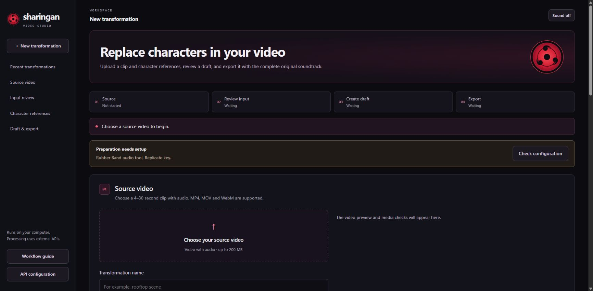

<p align="center"></p>
<h1 align="center">Sharingan</h1>
<p align="center"><strong>Replace characters in your video with your own identity references.</strong></p>
<p align="center">An open-source, local video transformation studio with direct Seedance API access.</p>
<p align="center"><a href="docs/SETUP-AGENT.md">Setup</a> · <a href="docs/SEEDANCE-API.md">API integration</a> · <a href="docs/AGENT-OPERATIONS.md">Agent workflow</a> · <a href="LICENSE">MIT license</a></p>

Sharingan replaces video characters while preserving the scene, performance and complete original soundtrack. Prepare a clip, inspect the guidance, generate a 480p draft, then explicitly approve a separate 1080p final. The interface uses charcoal, crimson and muted violet, an original SVG eye emblem, and optional synthesized activation sounds. Sound starts off and respects your saved preference; reduced-motion preferences are supported.

The source code, documentation, included emblem and synthesized sound code are MIT licensed. Hosted models and API services are external, paid services with their own terms; their model weights are not bundled. Sharingan runs locally and calls Seedance directly through BytePlus ModelArk with your own key.



## Quick start

Python 3.12+ and the Rubber Band CLI are required. No local GPU is needed for the default hosted preparation.

### Windows PowerShell

```powershell
py -3.12 -m venv .venv
.\.venv\Scripts\python.exe -m pip install -r requirements.txt
Copy-Item .env.example .env # only if .env does not already exist
# Edit .env privately, then:
.\.venv\Scripts\python.exe launch.py
```

Install Rubber Band from its official distribution and put `rubberband.exe` on PATH. WSL2 is also supported and is recommended for installing the optional face-mesh worker with the bundled Bash script. The core UI and depth workflow run on native Windows.

### macOS / Linux / WSL

```bash
# macOS: brew install python@3.12 rubberband
# Ubuntu/Debian/WSL: sudo apt install python3-venv rubberband-cli
bash setup.sh
# Edit .env privately, then:
bash start.command
```

Open **http://127.0.0.1:8770**. Set `PORT` to use another free port. Seedance tasks are polled directly; a tunnel or public callback is not required.

## Your API keys

Copy `.env.example` to `.env` only when `.env` is absent. Set:

```dotenv
SEEDANCE_API_KEY=your_byteplus_modelark_api_key
REPLICATE_API_TOKEN=your_replicate_token
```

Get your [ModelArk API key](https://ai.byteplus.com/ark/region:ap-southeast-1/apikey) and [Replicate token](https://replicate.com/account/api-tokens). Enable **Dreamina Seedance 2.5** in your ModelArk account and ensure the account can use paid inference. The default model is `dreamina-seedance-2-5-260628` and the API base is `https://ark.ap-southeast.bytepluses.com/api/v3`. `SEEDANCE_MODEL` and `SEEDANCE_BASE_URL` are configurable for a compatible ModelArk deployment. Older Seedance models do not support this complete video-editing/draft workflow.

Replicate supplies Demucs vocal separation, colored depth and SAM 3 preprocessing. `HF_TOKEN` is optional for an alternate hosted depth model. **API configuration** checks local packages, Rubber Band, provider key presence, media-host settings and the optional mesh worker. It shows no key values and does not verify remote access or balance. Unavailable preparation modes stay disabled until their requirements are ready. You can also run `python doctor.py --require-keys` using your virtual environment.

## Workflow

1. Choose an MP4, MOV or WebM with audio, 4–30 seconds long. Inspect its preview, duration, resolution and audio checks before preparing. Source audio must be compatible with unchanged copying into MP4; export with AAC audio if necessary.
2. Choose **Depth + SAM**, **Face mesh**, or **Depth + face mesh**. Mesh modes require the optional worker and are experimental for a single centered speaker.
3. Preserve the source, isolate vocals, pitch them +3 semitones without changing timing, and embed those vocals in the prepared video. Preserve the depth model's colors.
4. Inspect the **whole** prepared clip and its audio. Compare it with the original, step through individual frames and listen to the audio stems. Approval is tied to artifact hashes and becomes invalid after changes. **Needs fixing** blocks generation; **Repair mask from original video** rebuilds RGB segmentation for depth modes and requires another full review. Repair may use provider credits.
5. Supply a character image or MP4/MOV/WebM identity video; optionally add a second image. Explicitly describe which subject each reference replaces. WebM identity references are converted to MP4 video. **Review submission** validates the inputs locally and shows the exact prompt, including appended guidance. Confirm separately to start one paid 480p draft.
6. Retrieve the result and restore the complete original source soundtrack, discarding generated audio.
7. If satisfied, explicitly approve a separate paid 1080p final. Switch between the preserved draft and final using the version selector. Original audio is restored again. ModelArk draft IDs expire after seven days. Imported external results have no direct-API draft ID and cannot be upgraded through this control.

Open **Recent transformations** to search saved jobs and continue reviewing or collecting them. Name a transformation from its header, inspect **Processing activity**, or use **New variation from this source** to load the source and references for a fresh job. The four-step progress navigation remains visible on mobile. See the [studio guide](docs/STUDIO.md) for recovery and review details.

Video identity references remain videos. The prepared source is `@Video1`; a video identity is `@Video2` and contributes appearance only. With an image identity, use `@Image1`; a second image is `@Image2` (or `@Image1` when the primary identity is a video). Both reference types use the direct API's video-editing task.

Seedance fetches inputs from direct public HTTPS URLs. Tmpfiles is the default; persistent Catbox fallback is **opt in**. See [media hosting](docs/MEDIA-HOSTING.md) for expiry, visibility and private-storage customization. Input and reference videos must meet the provider's limits, including a combined maximum of 30 seconds.

### Optional face mesh

Install Python 3.12, then run `bash setup-face-mesh.sh` in macOS/Linux/WSL. This creates an isolated `.venv-face` worker and downloads Google's Face Landmarker model on first use. Fast mode uses no depth or SAM calls, but still uses hosted vocal separation. Review face tracking, eyes, mouth and alignment across all frames. Combined mode requires reviewing both masks and face tracking.

## Checks and recovery

```bash
python -m unittest discover -s tests -v
python test_composite.py
python doctor.py --require-keys
python workflow.py status LOCAL_JOB_ID
python workflow.py resume LOCAL_JOB_ID
python workflow.py resume LOCAL_JOB_ID --hd
```

Use the virtual environment's Python. Startup resumes collection of saved task IDs without resubmitting. A request is persisted before a paid POST; if submission times out or returns an uncertain response, inspect your ModelArk task list before any retry. Interrupted preprocessing requires inspecting saved prediction IDs. Keep one server/collector per job.

## Development and publishing

The app uses FastAPI, Uvicorn, PyAV, NumPy, Pillow, OpenCV, SciPy and vanilla HTML/CSS/JavaScript. Run `python launch.py` for local development. See [validation](docs/VALIDATION.md), [models](docs/MODELS.md) and [troubleshooting](docs/TROUBLESHOOTING.md).

Only publish source files. `.env`, virtual environments, runs, logs, downloaded model weights and caches are ignored. Runs contain private source media, generated output and provider URLs. No proprietary demonstration videos or companion artwork ship with this version. Add your own examples only when you have redistribution rights.

Sharingan is a localhost, single-user application. Authentication and a durable job queue would be required for a hosted multi-user service. It is an independent fan-inspired project; its name and visual theme do not imply affiliation with the creators of Naruto.

## License

[MIT](LICENSE). Original code attribution is retained. Third-party dependencies, hosted models and optional user media retain their own licenses and terms; see [third-party notices](THIRD-PARTY.md).
